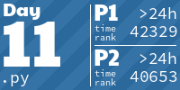
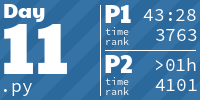
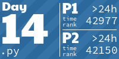
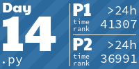
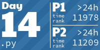
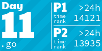
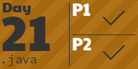

# AoC #

<!-- AOC TILES BEGIN -->
<h1 align="center">
  2023 - 22 ⭐
</h1>

<h1 align="center">
  2022 - 31 ⭐
</h1>

<h1 align="center">
  2021 - 29 ⭐
</h1>

<h1 align="center">
  2020 - 36 ⭐
</h1>

<h1 align="center">
  2019 - 6 ⭐
</h1>

<h1 align="center">
  2018 - 26 ⭐
</h1>

<h1 align="center">
  2017 - 50 ⭐
</h1>

<h1 align="center">
  2016 - 20 ⭐
</h1>

<h1 align="center">
  2015 - 50 ⭐
</h1>

<!-- AOC TILES END -->

